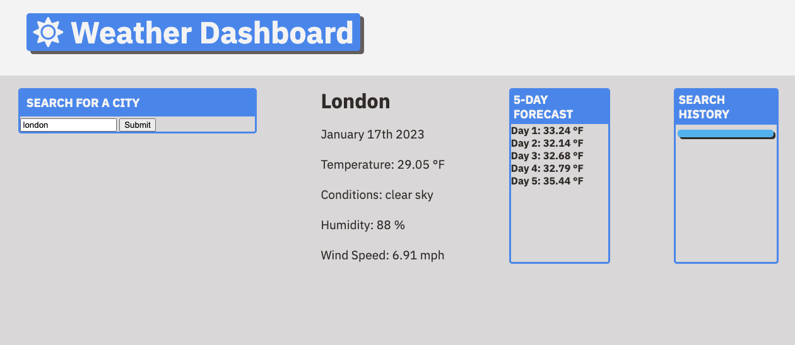

# Weather Dashboard

## Description

The weather dashboard displays a city's name, current date, temperature, conditions, humidity and wind speed. It also displays a 5-day forecast for that city. The user has to enter the name of a city and click "Submit". If the user enters a city name that is invalid, an error message will display.

## Visuals

## Link

Link to the completed webpage:
